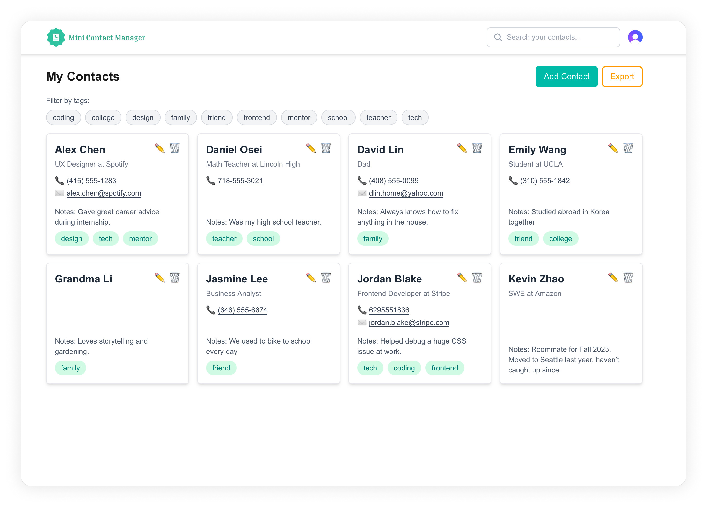
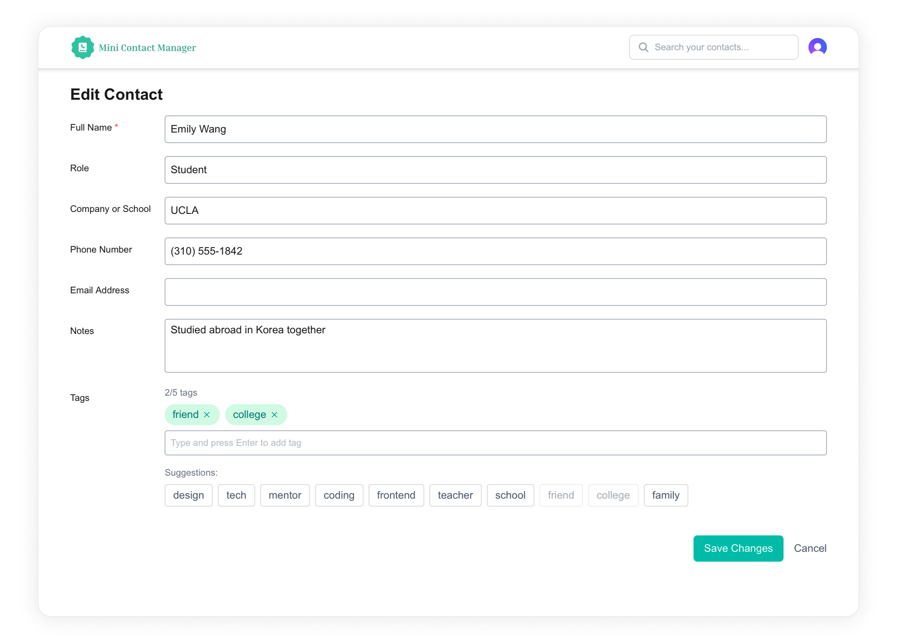

# 📇 Contacts Manager

A sleek and minimal contact management app built with Next.js 15, Tailwind CSS, and TypeScript. It features user authentication, full CRUD operations, tag-based filtering, responsive design, accessibility best practices, and unit testing.

## 🚀 Deployment

Live on [Vercel](https://mini-contacts-manager.vercel.app/)

You can try the app instantly using the following test credentials:

- **Email:** `demo@test.com`
- **Password:** `pass09876~`

✅ Feel free to create, edit, or delete contacts while testing!

## ✨ Features

- 🔐 **Authentication** with Clerk
- 📝 **Create / Edit / Delete** contacts
- 🏷️ Add and manage multiple **tags** per contact
- 🔍 **Search and filter** by name, role, company, notes, or tags
- 🎨 **Responsive** UI optimized for all screen sizes with system-based dark mode support
- ♿️ **Accessibility-first design** (focus trap, escape to close modal, keyboard navigation)
- ✅ **Unit tested** with Jest and React Testing Library
- ☁️ **Deployed** with Vercel and Prisma Accelerate

## 📸 Preview

### 🧾 Contact List View

Displays the searchable and tag-filterable contact cards.

### ➕ Add / Edit Contact Form

Accessible form with validation, tag input, and responsive layout.

## 🛠️ Tech Stack

- **Next.js 15 (App Router)**
- **TypeScript**
- **Tailwind CSS**
- **Clerk** (Auth)
- **Prisma + PostgreSQL** (Prisma Accelerate)
- **Jest + React Testing Library**

## 🧪 Unit Tests

Covers:

- Contact card rendering
- Form validation and submission
- Modal accessibility (focus management, ESC to close)

## 🙌 Acknowledgements

- [Clerk](https://clerk.com) for auth
- [Prisma](https://prisma.io) for database access
- [Jest](https://jestjs.io) for test execution
- [React Testing Library](https://testing-library.com) for accessible-first testing
